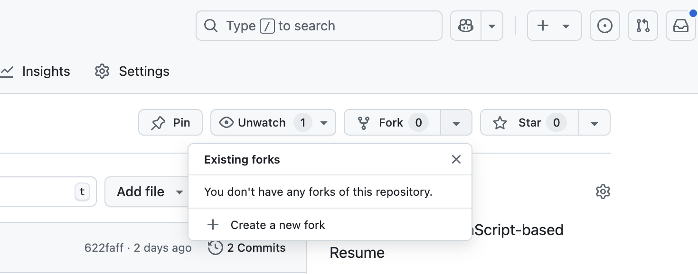

# Resume Template

A résumé template built with [Nuxt](https://nuxt.com/docs/getting-started/introduction) and [Nuxt UI](https://ui.nuxt.com).

# Build your own résumé/ CV

1. Fork this repository to your own account
   
2. Update files inside the `data` directory with your data.
3. Update files in `i18n/locales` directory with your data.
4. Update `data/config.json` with your data.
5. Copy your profile picture to `public/<your-picture>`.
6. Adapt colors in `app/app.config.ts`.
7. Install dependencies:
    ```bash
    npm install
    ```
8. Start the development server on:
    ```bash
    # npm
    npm run dev
    ```
9. Open the website at `http://localhost:3000`.
10. Print the website to PDF.

## Optional Steps to deploy your resume/ CV as a website

1. Build the application for production:
    ```bash
    # npm
    npm run build
    ```
2. Local preview production build:
    ```bash
    # npm
    npm run preview
    ```
3. Check out the [deployment documentation](https://nuxt.com/docs/getting-started/deployment) for more information on how to deploy your resume/ CV on a webserver.
